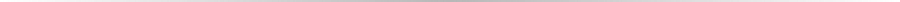
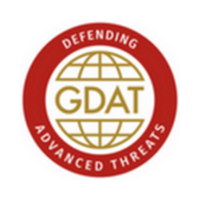
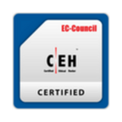
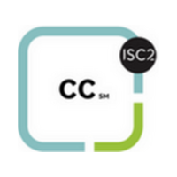
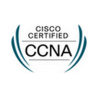

  

  <a href="#-hall-of-fame">Hall of Fame</a> ·
  <a href="#-published-cves">CVEs</a> ·
  <a href="#-letters-of-recognition">Letters</a> ·
  <a href="#-certifications">Certifications</a> ·
  <a href="#-contact">Contact</a>

<h2 align="center">🏆 Hall of Fame</h2>

  

  
    Verify:
    <a href="https://bugcrowd.com/h/alohadance">NASA</a> ·
    <a href="https://www.who.int/about/cybersecurity/vulnerability-hall-of-fame/ethical-hacker-list">WHO</a> ·
    <a href="https://www.unicef.org/digitalimpact/unicef-information-security-hall-fame">UNICEF</a> ·
    <a href="https://www.unesco.org/en/vulnerability-disclosure">UNESCO</a> ·
    <a href="https://www.ferrari.com/en-MY/hall-of-fame-responsible-disclosure-programme">FERRARI</a> ·
    <a href="https://www.bayer.com/en/cybersecurity-hall-of-fame">BAYER</a> ·
    <a href="https://www.synack.com/vdp/ed/acknowledgements/">US DEPT OF ED</a>
  

<h2 align="center">🚨 Published CVEs</h2>

  

  
    CVE-2026-38360:
    <a href="https://nvd.nist.gov/vuln/detail/CVE-2026-38360">NVD</a> ·
    <a href="https://github.com/advisories/GHSA-3rf6-x59v-5jfv">GHSA</a> ·
    <a href="https://github.com/a1ohadance/CVE-2026-38360">PoC</a>
     
    CVE-2026-38361:
    <a href="https://nvd.nist.gov/vuln/detail/CVE-2026-38361">NVD</a> ·
    <a href="https://github.com/advisories/GHSA-xp7f-v245-w3w8">GHSA</a> ·
    <a href="https://github.com/a1ohadance/CVE-2026-38361">PoC</a>
  

<h2 align="center">📜 Letters of Recognition</h2>

  
   
  

<h2 align="center">🎓 Certifications</h2>

  &nbsp;
  &nbsp;
  &nbsp;
  

| Code | Certification | Issuer | Year | Verify |
|:--:|:--|:--|:--:|:--:|
|  | GIAC Defending Advanced Threats | GIAC | 2024 | [↗](https://www.giac.org/certified-professional/Muhammad-Fitri-Mohd-Sultan/240813) |
|  | Certified Ethical Hacker | EC-Council | 2024 | [↗](https://aspen.eccouncil.org/VerifyBadge?type=certification&a=KZyiLz6qMNR+vA1iR+e61ZTZP/qtB6vOrpwpdLjMrgo=) |
|  | Certified in Cybersecurity | (ISC)² | 2023 | [↗](https://www.credly.com/badges/da40be5e-e050-48d0-a142-483e5625fe13/public_url) |
|  | Cisco Certified Network Associate | Cisco | 2023 | [↗](https://www.credly.com/badges/7be92268-642b-40de-b5b4-4c0d379abbc9/public_url) |

<h2 align="center">📫 Contact</h2>

  
  

